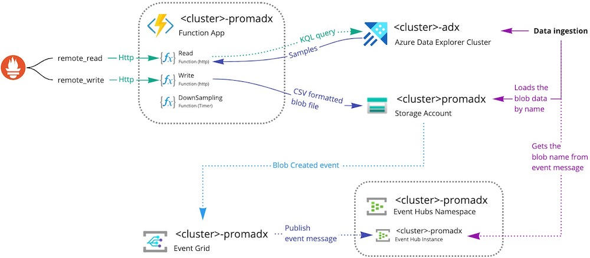

# Prometheus adapter for Azure Data Explorer

 


## Glossary

* [Overview](#overview)
* [How to run](#how-to-run)
* [How to develop](#how-to-develop)
* [Prometheus protocol buffer generator](PrometheusHelper/proto/README.MD)
* [KQL examples](#get-metrics-kql-example)

## Overview

This is a production-ready implementation of `Prometheus` remote storage adapter for `Azure Data Explorer` (a fast, fully managed data analytics service for real-time analysis on large volumes of data streaming).

The idea and first start for this project (previously it was a fork) became possible thanks to [PrometheusToAdx](https://github.com/cosh/PrometheusToAdx) repository.

The major functionality features:
1) Fully workable remote read/write;
1) Possible to write a large amounts of metrics because of ingesting data via sets of `blobstorage` -> `eventgrid` -> `eventhub` chain (see [integration principe](#integration-principe) bellow);
2) Does downsampling for old metrics for save db size.

### Information links:
* [Prometheus remote storage integrations](https://prometheus.io/docs/prometheus/latest/storage/#remote-storage-integrations)
* [Azure Data Explorer data ingestion](https://docs.microsoft.com/en-us/azure/data-explorer/ingest-data-overview)

### Integration principe


[miro](https://miro.com/app/board/o9J_lczmDj4=/)

# How to run

## 1. Required resources table

Resource | Resource Type
---|---
`<cluster>-prometheus-adx` | Service Principal
`<cluster>-prometheus-adx` | Function App
`<cluster>-adx` | Azure Data Explorer Cluster
`<cluster>prometheusadx`  | Storage  Account
`<cluster>-prometheus-adx` | Event Hub Namespace
`<cluster>-prometheus-adx` | Event Hub Instance
`<cluster>-prometheus-adx` | Event Grid Subscription

## 2. Step-by-step guide

1) Create `Service Principal` account;
2) Create `Storage Account`;
3) Create `Azure Data Explorer Cluster`;
4) Create `Function App`;
5) Add `Contributor` for `Service Principal` account;
6) Add `Admin` for `Azure Data Explorer Cluster` database (only for database);
7) Create `Event Hub Namespace` with `Event Hub` Instance
8) Create `Event Grid Subscription` with following options:
	* Topic type - **Storage Accounts**
	* Topic resource - `Storage  Account` (2)
	* Filter event type - **Blob created**
	* Endpoint details - `Event Hub` (7)
9) Create database `<cluster>-prometheus` in `Azure Data Explorer Cluster`:
	* Permissions: Add `View` role for `Service Principal` (1)
	* Create tables `RawData`, `Metrics` (KQL bellow)
	* Data injestion:
		* Connection type - **Blob storage**
		* Storage Account / Event Grid - `Storage Account` (2) and `Event Grid Subscription` (8)
		* Event type - **Blob created**
		* Table - **Metrics**
		* Data format - **CSV**
		* Mapping name - **CsvMapping**

## Init tables KQLs

```
.drop table Metrics ifexists
.drop table RawData ifexists

.create table RawData (Datetime: datetime, Timestamp: long, Name: string, Instance: string, Job: string, Labels: dynamic, LabelsHash: long, Value: real)

.create-or-alter table RawData ingestion csv mapping 'CsvMapping'
'['
'   { "column" : "Datetime", "DataType":"datetime", "Properties":{"Ordinal":"0"}},'
'   { "column" : "Timestamp", "DataType":"long", "Properties":{"Ordinal":"1"}},'
'   { "column" : "Name", "DataType":"string", "Properties":{"Ordinal":"2"}},'
'   { "column" : "Instance", "DataType":"string", "Properties":{"Ordinal":"3"}},'
'   { "column" : "Job", "DataType":"string", "Properties":{"Ordinal":"4"}},'
'   { "column" : "Labels", "DataType":"dynamic", "Properties":{"Ordinal":"5"}},'
'   { "column" : "LabelsHash", "DataType":"long", "Properties":{"Ordinal":"6"}},'
'   { "column" : "Value", "DataType":"real", "Properties":{"Ordinal":"7"}},'
']'

.alter-merge table RawData policy retention softdelete = 4d recoverability = disabled

.create table Metrics (LabelsHash: long, StartDatetime: datetime, EndDatetime: datetime, Name: string, Instance: string, Job: string, Labels: dynamic, Samples: dynamic)
```

# How to develop

This repo contains [.devcontainer](https://code.visualstudio.com/docs/remote/containers) for VSCode, which runs a set of containers with:
* Prometheus server as is
* Prometheus server with remote_read/remote_write for local debug
* Prometheus server with remote_read/remote_write for local debug
* Grafana
* Node-exporter node for some example data
* Dev-container with .net core for azure functions installation with all requirements and vscode extensions for C# development

### Before run within .devcontainer:

Check the `.devcontainer/devcontainer.json` file > `remote Env` section for environment vars. 

You can fill this vars right in this file or later in the `./local.settings.json` config file or in the debug settings configuration file (preferred way)

### Prometheus protocol buffer generator

* This repo uses prometheus .proto and convert them via `protoc` util to C# classes
* Follow [this documentation](PrometheusHelper/proto/README.MD) and scripts to get, compile and keep up the latest versions

## Additional information

### Prometheus read/write format

```
Samples:[
	{
		timestamp:
		value:
	},
	{
		timestamp:
		value:
	}...
],
Labels:[
    {
		name:
		value:
	},
	{
		name:
		value:
	}...
]
```

### Get metrics KQL example
```
Metrics
| where (EndDatetime >= unixtime_milliseconds_todatetime(1591084670098)) and (StartDatetime <= unixtime_milliseconds_todatetime(1591092170098)) and ( ( Name == 'mysql_global_status_queries' ) )
| summarize Labels=tostring(any(Labels)), Samples=make_list( Samples ) by LabelsHash
| mv-apply Samples = Samples on
(
    order by tolong(Samples['Timestamp']) asc
    | summarize Samples=make_list(pack('Timestamp', Samples['Timestamp'], 'Value', Samples['Value']))
)
```
